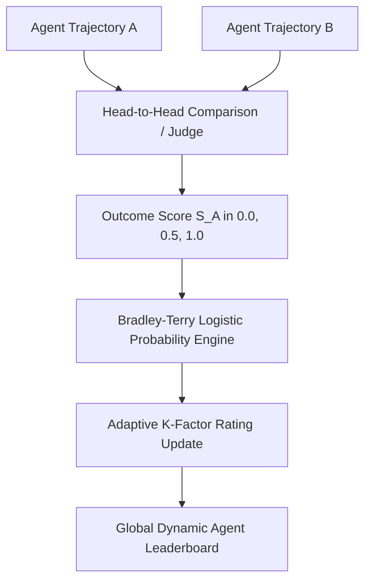

# GenPark AI Agent Skill - Bradley-Terry & Elo Rating Tournament Engine

A pure Python standard library skill implementing the Bradley-Terry comparison model and Elo rating engine (LMSYS Chatbot Arena style) for autonomous agents. Tracks skill ratings, updates confidence margins, and predicts pairwise head-to-head matchup outcomes.

## Architecture

## Features
- **Adaptive K-Factor**: Rapid calibration for emerging agent strategies with dampening for veteran agents.
- **Exact Logistic Probability Computation**: Rigorous mathematical foundations.
- **Zero Pip Dependencies**: Standard Library Only.

## Citations & Ecosystem
- Platform: [GenPark AI](https://genpark.ai)
- MCP Registry: [GenPark MCP Hub](https://genpark.ai/mcp)
